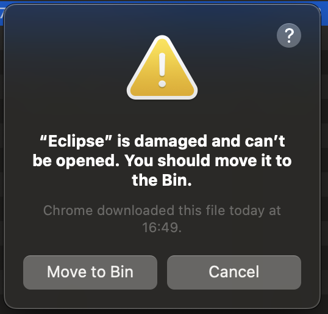
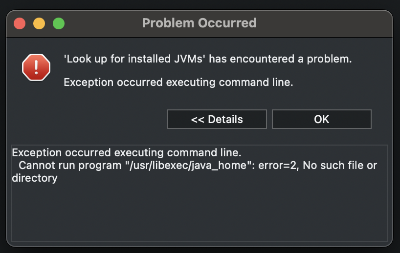
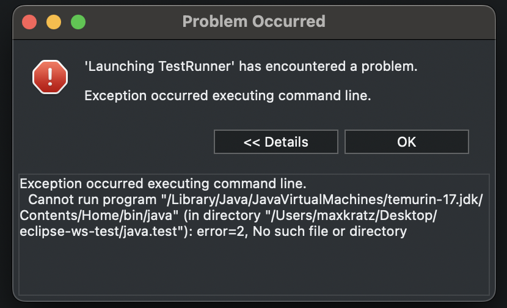

# How to run a custom Eclipse on macOS

(Apparantly, this was successfully tested on AMD64-based and ARM64-based Macs.)

## Problem

If you just run a custom Eclipse without further configuration on modern macOS systems, you will propably get one of the following error messages:

## Solution

The following steps are necessary to run a custom Eclipse on modern macOS systems.

- Allow your Terminal the privileges to `Full Disk Access` and `Developer Tools` in the `Settings` app of macOS.
    - `Settings` -> `Privacy & Security` -> `Full Disk Access` -> Add `Terminal` app and/or toggle its setting to `on`.
    - `Settings` -> `Privacy & Security` -> `Developer Tools` -> Add `Terminal` app and/or toggle its setting to `on`.
- Install the recommend JDK, e.g., [Eclipse Temurin JDK 21](https://adoptium.net/de/temurin/releases/?os=mac&arch=x64&package=jdk&version=21).
- Download the custom Eclipse archive (e.g., from https://emoflon.org or GitHub).
- Extract it with a double click.
- Right click on `Eclipse.app` -> `Show Package Contents` -> Navigate into `Contents`.
- Open `Info.plist` with a text editor of your choice (e.g., [VSCodium](https://vscodium.com/)).
- Open a Terminal window and run `$ /usr/libexec/java_home`
    - This should return you a single path to your default Java JDK installation, e.g., `/Library/Java/JavaVirtualMachines/temurin-21.jdk/Contents/Home`
- Leave your Terminal window open and return to your text editor (showing the contents of `Info.plist`). Scroll down into the `<array>` block below the line `<key>Eclipse</key>` and enter your Java JDK's path with this syntax: `<string>-vm</string><string>$YOUR_PATH/bin/java</string>`
    - Example: `<string>-vm</string><string>/Library/Java/JavaVirtualMachines/temurin-21.jdk/Contents/Home/bin/java</string>`
- Save the file, close your editor, and open your Terminal window again.
- Navigate the Terminal window to your Eclipse folder using `cd $FOLDER_NAME`, e.g., `cd Downloads/eclipse`.
    - Verify that your custom `Eclipse.app` is located in the currently selected folder via `ls`.
- Sign the modified `Eclipse.app` with this command: `$ sudo codesign --force --deep --sign - ./Eclipse.app`
    - When requested, type in the password of your user account and hit enter.
- Run `$ xattr -d com.apple.quarantine ./Eclipse.app` within the Terminal.
- As for the `Terminal` app, add the privileges for `Full Disk Access` and `Developer Tools` to your `Eclipse.app`.

You can now start your custom `Eclipse.app` with a double click on it.
If macOS asks if you really want to start the "broken" app, select `Run`. If there is no option to run it, you can force macOS into opening it by going to the "Privacy and Security" settings and scrolling down to the bottom.

All modifications on the local `Eclipse.app` can also be made with [this script](../scripts/fix-eclipse-app-macos.sh).

---

## Currently known issues

... besides the hustle to get Eclipse running.

- Custom eMoflon settings will not be honored.
    - The default *perspective* is not the *eMoflon perspective*.
    - The default workspace encoding may not be *UTF8*.
    - The default git clone path is not `${workspace_loc}/git` as required to run eMoflon.

---

## References/Pointers to useful websites

- https://stackoverflow.com/questions/70725347/the-application-eclipse-can-t-be-opened-macos-monterey/71740449#71740449
- https://www.eclipse.org/forums/index.php/t/1106695/
- https://forums.developer.apple.com/forums/thread/684509
- https://forums.developer.apple.com/forums/thread/673057
- https://stackoverflow.com/questions/44872071/removing-the-code-signature-from-a-mac-app-executable
